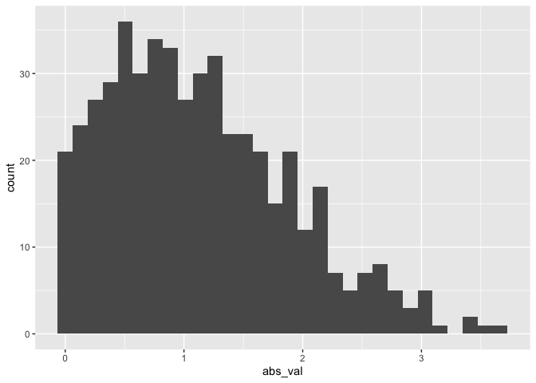

Simple document
================
Jeff Goldsmith
2021-09-16

``` r
library(tidyverse)
```

I’m an R Markdown document!

# Section 1

Here’s a **code chunk** that samples from a *normal distribution*:

``` r
samp = rnorm(100)
length(samp)
```

    ## [1] 100

# Section 2

I can take the mean of the sample, too! The mean is -0.0142241.

# Section 3

Let’s write a new code chunk.

This code chunk imports the ’tidyverse,creates a data frame, and makes a
histogram.

``` r
set.seed(1234)

plot_df =                           
  tibble(
    x = rnorm(1000, sd = .5),
    y = 1 + 2 * x + rnorm(1000),
  )

ggplot(plot_df, aes(x = x, y = y)) + geom_point()
```

<!-- -->

### Learning Assessent

Write a named code chunk that creates a dataframe comprised of: a
numeric variable containing a random sample of size 500 from a normal
variable with mean 1; a logical vector indicating whether each sampled
value is greater than zero; and a numeric vector containing the absolute
value of each element. Then, produce a histogram of the absolute value
variable just created.

``` r
set.seed(12)

learning_df = 
  tibble(
    sample = rnorm(500, mea = 1),
    gr_than_0 = sample > 0,
    abs_val = abs(sample)
  )

ggplot(learning_df, aes(x = abs_val)) + geom_histogram()
```

    ## `stat_bin()` using `bins = 30`. Pick better value with `binwidth`.

<!-- -->

-   here’s a list
-   here’s more of my list
